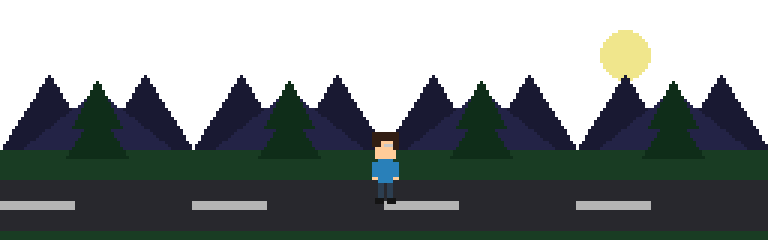
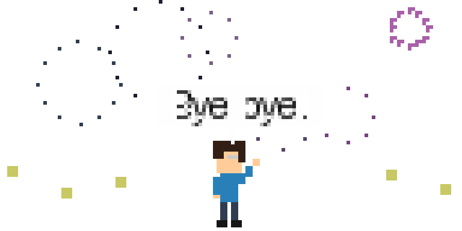

# Hi I'm Nanda Putra Hartono! 👋

<!-- Custom generated retro game scrolling banner -->

---

### 🔗 Connect with me

---

## 🙋‍♂️ About Me

I am a passionate **Web Developer, Mobile Developer, and AI Engineer** from Indonesia. I love building impactful applications and exploring new technologies.

**Education Journey:**
- **University:** Universitas Catur Insan Cendikia (IT Student)
- **SMA:** SMA IT Nuurusshiidiq
- **SMP:** SMP IT Nuurusshiidiq
- **SD:** SDN 1 Jadimulya
- **TK:** Al-Huda

---

## 💻 Tech Stack

**Languages:**
 

**Frameworks:**
 

**Tools & Environment:**
 

---

## 🚀 Active Projects

| Project Name | Status | Type |
|--------------|--------|------|
| **Website Rakit-AI** | ✅ Complete | Web |
| **N-Library** | 🚧 In Development | Discord Bot |
| **Website Kosonline** | 🚧 In Development | Web |
| **Portfolio** | 🚧 In Development | Web |

---

## 📊 GitHub Stats

  
   
  

---

## 🐍 Contribution Graph (Snake Animation)

  <!-- Note: You need to set up a GitHub Action to generate this snake svg. The link below assumes it will be generated in an 'output' branch. -->
  <picture>
    <source media="(prefers-color-scheme: dark)" srcset="https://raw.githubusercontent.com/nandaputrahartono-pc/nandaputrahartono-pc/output/github-contribution-grid-snake-dark.svg">
    <source media="(prefers-color-scheme: light)" srcset="https://raw.githubusercontent.com/nandaputrahartono-pc/nandaputrahartono-pc/output/github-contribution-grid-snake.svg">
    
  </picture>

---

## 🎵 Favorite Song

  <a href="https://open.spotify.com/track/59h6J25QnnT8xshPTFLkpe">
    
     
    <b>Bubble (Abuku) - Yorushika</b> 
    
  </a>

---

## 💖 Support Me

If you like my work, consider supporting me!

  
  

---

  

